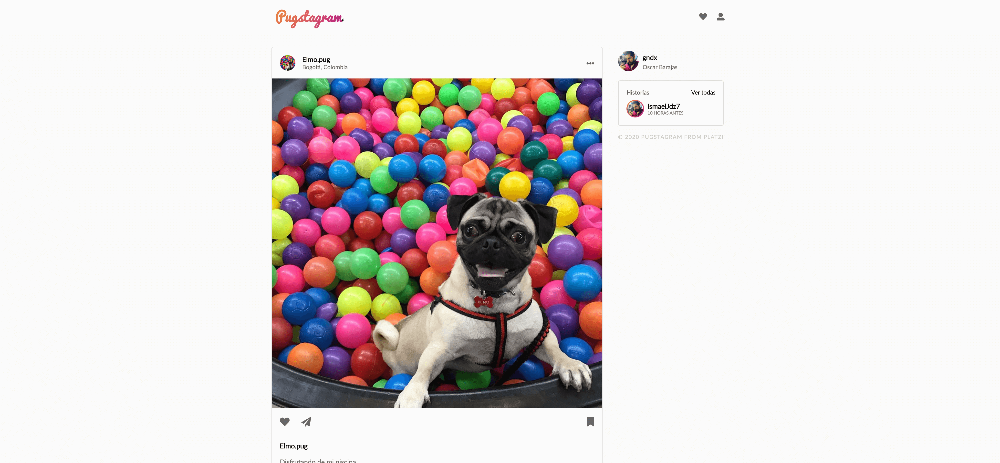

# App clon instagram de pugs

Esta es una aplicacion creada con el framework SvelteJs un clon de instagram pero de pugs

[ver la aplicación](https://pugstagram-isma.netlify.app//)

## Cómo funciona?

Requiere nodeJs

- `npm install` para instalar las dependencias.
- `npm run start` para el entorno de desarrollo.

## Licencia

MIT
